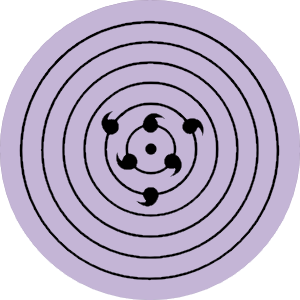

# Mini-Simulador-Uchiha-Sasuke  
Esse é um mini simulador do Uchiha Sasuke onde o mouse é uma shuriken e o olho do Sasuke fica movendo para a shuriken e que pode ativar o sharingan, esse mini projeto foi feito durante as minhas aulas simples mas que eu fiz algo melhor e mais complexo que pedido.
